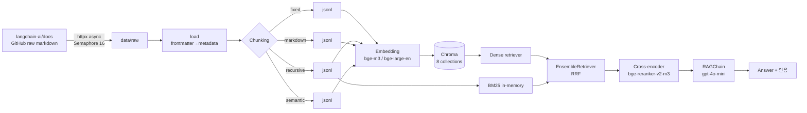
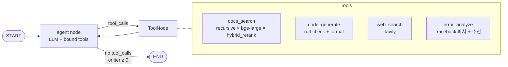
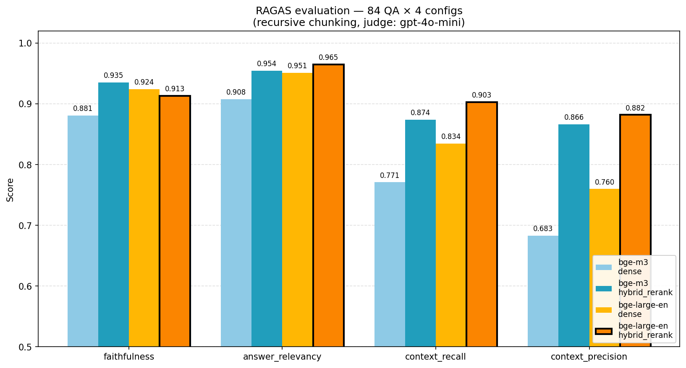
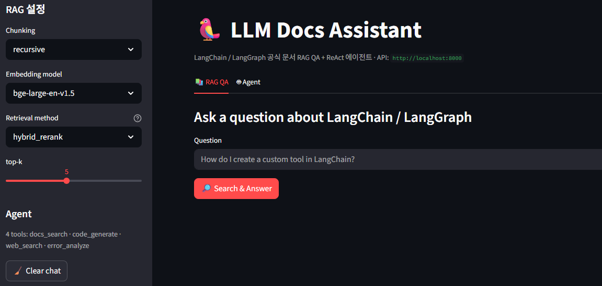
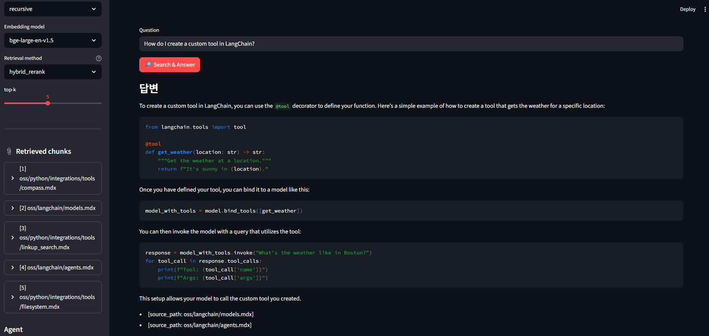
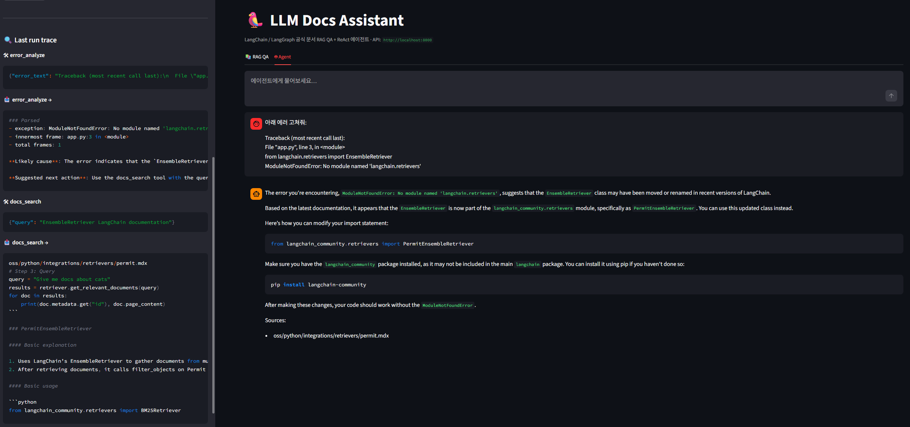
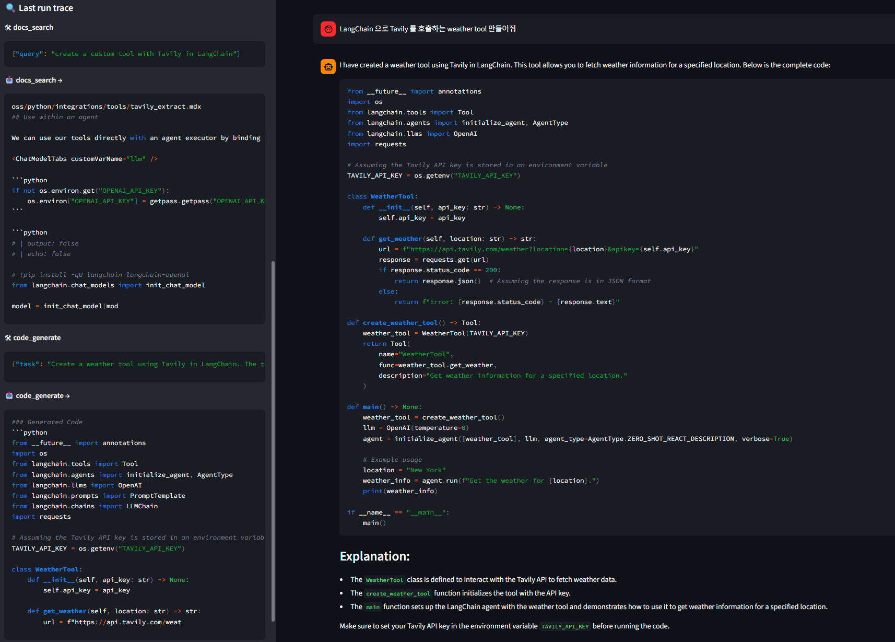

# LLM Docs Assistant

LangChain / LangGraph 공식 문서를 대상으로 한 **RAG QA 시스템 + ReAct 코딩 어시스턴트 에이전트**.
AI 개발자 포트폴리오 프로젝트 — 검색 품질 최적화(청킹 · 임베딩 · hybrid · rerank)부터
LangGraph 멀티툴 에이전트 구현, RAGAS 정량 평가까지 end-to-end 로 다룬다.

> **왜 만들었나.** LLM 앱을 개발할 때마다 LangChain · LangGraph 의 방대한 공식 문서를
> 수동 검색하고, 버전별로 달라지는 API 를 일일이 대조하는 비효율이 컸다. 이를
> "문서 기반 QA + 코드 생성" 으로 자동화하는 동시에, RAG 파이프라인의 각 구성요소
> (청킹 · 임베딩 · 검색 · 재정렬)를 실험적으로 비교해 **무엇이 얼마나 기여하는지
> 정량적으로 검증**하는 것이 이 프로젝트의 목표다.

---

## 하이라이트

- **1,522 개 공식 문서** 크롤링 (`langchain-ai/docs` repo, oss/python 계열)
- **4 청킹 전략 × 2 임베딩 모델 = 8 Chroma 컬렉션** 비교 실험
- **Hybrid (BM25 + dense) + Cross-encoder reranker** 로 retrieval 품질 단계적 개선
- **RAGAS 정량 평가** 로 4 config 비교 → 최적 구성 선정
- **LangGraph ReAct 에이전트** + 4 tool (`docs_search`, `code_generate`, `web_search`, `error_analyze`)
- **OpenAI ↔ AWS Bedrock 프로바이더 스위칭** (`.env` 한 줄) + 요청당 **토큰·비용 추적**
- **간접 프롬프트 인젝션 방어 계층** (데이터 경계 래핑 + 휴리스틱 플래그) + 인젝션 테스트 스위트
- **thread 기반 영속 대화** (LangGraph checkpointer) + **SSE 실시간 스트리밍**
- **에이전트 수준 정량 평가** — 테스트 4분면 48문항, 툴 선택 정확도/멀티스텝/인용 준수 기계 판정
- **MCP 서버** — 자체 검색엔진(docs_search)을 MCP 표준으로 노출, Claude Code에서 바로 사용
- **Streamlit 데모 UI** 로 RAG QA + 에이전트 채팅(스트리밍) 모두 시연 가능

---

## 아키텍처

### RAG 파이프라인



### ReAct 에이전트 그래프



---

## 실험 결과 요약

### Retrieval 최적화 (recursive 청킹 기준)

| 임베딩 | 방식 | hit@10 | MRR@10 |
|---|---|---|---|
| bge-m3 | dense | 0.821 | 0.634 |
| bge-m3 | hybrid | 0.881 | 0.679 |
| **bge-m3** | **hybrid + rerank** | **0.940** | **0.792** |
| bge-large-en-v1.5 | dense | 0.857 | 0.693 |
| bge-large-en-v1.5 | hybrid | 0.905 | 0.733 |
| **bge-large-en-v1.5** | **hybrid + rerank** | **0.940** | **0.821** |

> Reranker 가 hit@10 보다 **MRR 을 크게 개선** (+0.158 / +0.128) —
> 즉 "정답이 top-k 안에 들어왔는가" 보다 "상위에 밀어올렸는가" 에 크게 기여.

### RAGAS 종합 평가 (84 QA, 판정자 `gpt-4o-mini`)

| Config | answer_relevancy | faithfulness | context_recall | context_precision |
|---|---|---|---|---|
| recursive × bge-m3 × hybrid_rerank | 0.954 | **0.935** | 0.874 | 0.866 |
| **recursive × bge-large-en × hybrid_rerank** | **0.965** | 0.913 | **0.903** | **0.882** |
| recursive × bge-m3 × dense | 0.908 | 0.881 | 0.771 | 0.683 |
| recursive × bge-large-en × dense | 0.951 | 0.924 | 0.834 | 0.760 |

**프로덕션 구성**: `recursive × bge-large-en-v1.5 × hybrid_rerank`
(3개 지표 1위, faithfulness 만 bge-m3 대비 0.022 열세)



> 차트는 `uv run python -m src.rag.evaluation.plot_ragas` 로 재생성. 아키텍처
> 다이어그램 PNG 버전(`docs/images/arch_rag.png`, `docs/images/arch_agent.png`)은
> `uv run python scripts/render_mermaid.py` 로 생성된다 — GitHub 외 노션/PDF
> 포트폴리오에서 재활용용.

자세한 비교와 이상 현상 분석은 [`experiments/ragas_eval.md`](./experiments/ragas_eval.md)
와 [`docs/portfolio/problem_solving.md`](./docs/portfolio/problem_solving.md) 참고.

---

## 프로덕션 계층 (안전 · 운영 · 비용)

RAG 실험을 넘어 **안전·운영·비용까지 갖춘 에이전트 서비스**로 끌어올린 업그레이드:

| 영역 | 구현 | 코드 |
|---|---|---|
| 프로바이더 추상화 | `LLM_PROVIDER=openai\|bedrock` 전환 (Bedrock은 Claude 추론 프로파일, 자격증명은 IAM 역할) | `src/rag/generation/llm.py` |
| 비용 가시성 | 요청당 토큰·추정 비용(USD/KRW)을 API 응답 + 구조화 로그로 — 에이전트는 스텝별 합산 | `src/rag/generation/usage.py` |
| 인젝션 방어 | 도구 결과를 `<tool_output>` 데이터 경계로 래핑 + 닫는태그 이스케이프 + 의심 패턴 8종 플래그. 페이로드 7종 테스트 스위트 | `src/agent/security/` |
| 입력 필터 (선택) | Bedrock Guardrail 설정 시 LLM 호출 전 선검사 — 차단 시 토큰 비용 0 | `src/agent/security/input_guard.py` |
| 대화 영속화 | `thread_id` 기반 checkpointer(SqliteSaver) — 서버 재시작에도 대화 유지, `trim_messages`로 입력 토큰 상한 관리 | `src/api/main.py` |
| 실시간 스트리밍 | SSE로 토큰 델타 + 도구 호출 이벤트 전송, Streamlit `write_stream` 점진 렌더링 | `/agent/thread/stream` |
| 에이전트 평가 | 테스트 4분면 48문항 자동 채점 (아래 표) | `src/agent/evaluation/` |
| 도구 표준화 | docs_search/error_analyze를 MCP stdio 서버로 노출 | `src/mcp_server/` |
| AWS 배포 경로 | GPU 컴포넌트를 Bedrock 관리형(Titan 임베딩)으로 스왑하는 compose 오버라이드 + 가이드 | [`docs/deployment_aws.md`](./docs/deployment_aws.md) |

### 에이전트 수준 평가 (테스트 4분면, 48문항 기계 판정)

RAG 품질(RAGAS)과 별개로 **에이전트의 행동 자체**를 잰다 — 툴 선택 정확도(의도한
도구를 불렀는가 / 금지 도구를 안 불렀는가), 멀티스텝 성공률(docs_search → code_generate
연쇄 순서), Sources 인용 형식 준수율(정규식 판정).

| 분면 (각 12문항) | 툴 선택 정확도 | 멀티스텝 성공률 | 인용 준수율 | 평균 스텝 | 1건 평균 비용 |
|---|---|---|---|---|---|
| ① docs_search 단독 | 100% | — | 91.7% | 2.0 | $0.0009 (~₩1.2) |
| ② code_generate 단독 (순수 파이썬) | 100% | — | — | 5.0 | $0.0020 (~₩2.7) |
| ③ 복합 멀티스텝 (검색→코드생성) | 83.3% | 83.3% | — | 5.0 | $0.0024 (~₩3.3) |
| ④ 도구 불필요 | 100% | — | — | 1.0 | $0.0004 (~₩0.5) |
| **전체 (48문항)** | **95.8%** | **83.3%** | **91.7%** | | |

실패 2건은 모두 "LangChain API 코드 작성인데 docs_search를 건너뛰고 code_generate만
반복" 패턴 — [알려진 한계](#알려진-한계-phase-4-에이전트) (a)와 일치하며, 정량 평가가
이 한계를 재현 가능한 숫자로 잡아낸 것이 이 하네스의 가치다. (gpt-4o-mini 기준, 환율 1,400원)

재현: `uv run python -m src.agent.evaluation.run` → [`experiments/agent_eval.md`](./experiments/agent_eval.md)

### API 엔드포인트

| 엔드포인트 | 방식 | 설명 |
|---|---|---|
| `POST /rag/qa` | sync | 1-turn RAG QA (retrieval 설정 전환 가능, usage 포함) |
| `POST /agent/chat` | sync | stateless 멀티턴 (클라이언트가 히스토리 전송, 하위호환) |
| `POST /agent/thread/chat` | sync | **thread 기반 영속 대화** — `thread_id` + 새 메시지만 |
| `POST /agent/thread/stream` | SSE | 스트리밍 버전 — `token`/`tool_call`/`tool_result`/`done` 이벤트 |
| `GET /agent/thread/{id}/history` | sync | 저장된 대화 복원 (UI 이어하기) |

### MCP 서버로 쓰기 (Claude Code)

```bash
claude mcp add langchain-docs -- \
    uv --directory /path/to/llm-docs-assistant run --extra mcp \
    python -m src.mcp_server.server
```

등록하면 Claude Code 안에서 `docs_search`(hybrid+rerank 검색)와 `error_analyze`를
바로 쓸 수 있다 — AgentCore Gateway에서 배운 "도구 표준화"의 셀프호스팅 구현.

---

## Quickstart

### 1. 설치

```bash
uv sync                     # 의존성 설치 (CUDA torch 포함)
cp .env.example .env        # OPENAI_API_KEY, TAVILY_API_KEY 채우기
```

### 2. 데이터 준비

```bash
# 1,522 개 문서 크롤링 (~31MB)
uv run python -m src.rag.ingest.crawl

# 4 전략으로 청킹 → data/processed/chunks/*.jsonl
uv run python -m src.rag.chunking.run

# 임베딩 + Chroma 적재 (GPU 권장)
uv run python -m src.rag.embedding.run --strategy recursive \
    --provider huggingface --model BAAI/bge-large-en-v1.5
```

> 10GB 급 GPU 의 경우 `EMBEDDING_BATCH_SIZE=8` 과
> `PYTORCH_CUDA_ALLOC_CONF=expandable_segments:True` 권장.

### 3. 실행

```bash
# CLI QA
uv run python -m src.rag.generation.cli "How do I create a custom tool in LangChain?"

# ReAct 에이전트
uv run python -m src.agent.cli "LangGraph 에서 conditional edge 쓰는 법" -v

# FastAPI 서버
uv run uvicorn src.api.main:app --reload --port 8000

# Streamlit 데모 UI (RAG QA + Agent 두 탭, API 를 호출)
uv run streamlit run src/ui/app.py
```

### 3-1. Docker Compose (원커맨드)

```bash
# 최초 1회: 호스트에서 임베딩 적재 (GPU 사용 권장)
uv run python -m src.rag.embedding.run --strategy recursive \
    --provider huggingface --model BAAI/bge-large-en-v1.5

# 세 컨테이너 기동: chromadb(8001) + api(8000) + ui(8501)
docker compose up --build
```

서비스 구성:

| 컨테이너 | 포트 | 역할 |
|---|---|---|
| `chromadb` | 8001→8000 | Chroma 서버, 호스트 `data/processed/chroma` 마운트 |
| `api` | 8000 | FastAPI (`/rag/qa`, `/agent/chat`, `/agent/thread/*`, `/health`) |
| `ui` | 8501 | Streamlit — `API_BASE_URL=http://api:8000` 로 호출 |

> **AWS 배포**: `docker compose -f docker-compose.yml -f docker-compose.aws.yml up -d`
> 로 GPU 없는 EC2에서 Bedrock 관리형 스택(Titan 임베딩 + Claude)으로 기동.
> 절차는 [`docs/deployment_aws.md`](./docs/deployment_aws.md).

API 만 단독 기동하려면 `docker compose up api`. Streamlit 은 API 가 살아있는지
`/health` 를 폴링하므로 API 가 뜨기 전엔 빨간 경고를 띄운다.

#### GPU / CPU 모드

기본 `docker-compose.yml` 은 **GPU 모드** (`EMBEDDING_DEVICE=cuda` + NVIDIA
runtime reservation). 임베딩/리랭커(`bge-large-en-v1.5` + `bge-reranker-v2-m3`)
를 CUDA 로 올려 워밍업 후 RAG QA 1건 약 6초. 전제:

- NVIDIA 드라이버 + `nvidia-container-toolkit` 설치
  (`sudo apt install nvidia-container-toolkit && sudo nvidia-ctk runtime configure --runtime=docker`)
- `docker run --rm --gpus all nvidia/cuda:12.4.0-base-ubuntu22.04 nvidia-smi` 가
  동작해야 함

**GPU 없는 환경**에서 돌리려면 compose 의 `api` 서비스에서 다음을 수정:

```yaml
    environment:
      - EMBEDDING_DEVICE=cpu   # cuda → cpu
    # deploy: 블록 전체 삭제
```

CPU 모드는 RAM 4~6GB 점유, 응답은 수 초~십 수 초 수준.

#### HF 캐시 영속화

`api` 컨테이너는 `./data/hf_cache` 를 `/root/.cache/huggingface` 로 마운트한다.
최초 기동 시 bge-large-en (1.3GB) + bge-reranker-v2-m3 (2.3GB) 가 호스트에
캐시되어, 이후 `docker compose down && up` 에도 재다운로드 없이 **첫 호출 4분 →
16초** 수준으로 줄어든다. 이 디렉터리는 git-ignored.

### 4. 평가 재현

```bash
# QA 데이터셋 빌드 (28 파일 × 3 QA = 84개)
uv run python -m src.rag.evaluation.build_dataset

# Retrieval 벤치 (4×2 매트릭스)
uv run python -m src.rag.evaluation.retrieval_eval

# 최적화 비교 (dense / hybrid / hybrid_rerank)
uv run python -m src.rag.evaluation.retrieval_optim

# RAGAS
uv run python -m src.rag.evaluation.ragas_eval

# 에이전트 수준 평가 (테스트 4분면 48문항)
uv run python -m src.agent.evaluation.run
```

---

## 스크린샷

### RAG QA — 초기 화면
사이드바에서 chunking / embedding model / retrieval method / top-k 를 즉석에서 전환.



### RAG QA — 답변 + 인용 청크
질문에 대한 답변 본문과, 실제 검색된 문서 청크(`source_path` + snippet)가 사이드바에 expandable 형태로 표시됨.



### Agent — `error_analyze` → `docs_search` 체인
`ModuleNotFoundError: No module named 'langchain.retrievers'` 트레이스백을 붙여
질문하면, 에이전트가 먼저 **`error_analyze`** 로 예외를 파싱한 뒤 **`docs_search`**
로 공식 문서에서 해결책을 찾아 "`langchain.community` / `langchain-classic` 로 이관됨"
이라는 정확한 답을 생성한다. 사이드바 trace 에 2-step tool chain 이 그대로 노출됨.

> 이 케이스는 LangChain 1.2 마이그레이션 (`langchain.retrievers` → `langchain-classic`)
> 을 다루는데, 이는 본 프로젝트 자체가 겪었던 문제
> ([problem_solving #9](./docs/portfolio/problem_solving.md))다 — 에이전트가 자기
> 프로젝트의 과거 이슈를 스스로 해결하는 도그푸딩 성공 사례.



### Agent — `docs_search` + `code_generate` 멀티툴 오케스트레이션
"LangChain 으로 Tavily 를 호출하는 weather tool 만들어줘" 에 대해 에이전트가
`docs_search` 를 **2회** (API 탐색 + import path 확인), 이어서 `code_generate`
를 **2회** (초안 생성 + 리팩터링) 호출하는 **4-step ReAct 루프**. LangGraph 의
agent ↔ tools 루프가 실제로 다단계 tool 체인을 돌리는 장면.



---

## 프로젝트 구조

```
llm-docs-assistant/
├── src/
│   ├── rag/
│   │   ├── ingest/       # 크롤링 + 로딩
│   │   ├── chunking/     # fixed / recursive / markdown / semantic
│   │   ├── embedding/    # HF / OpenAI embedder + Chroma 적재
│   │   ├── retrieval/    # retriever / hybrid / rerank
│   │   ├── generation/   # RAGChain + CLI
│   │   └── evaluation/   # 데이터셋 빌드 + retrieval 벤치 + RAGAS
│   ├── agent/
│   │   ├── state/        # AgentState TypedDict
│   │   ├── graph/        # LangGraph ReAct 그래프
│   │   ├── tools/        # 4 tool 구현
│   │   └── cli.py
│   └── ui/app.py         # Streamlit 데모
├── data/
│   ├── raw/              # 크롤링 원본 (git-ignored)
│   ├── processed/        # 청크 jsonl + Chroma
│   └── eval/             # QA 데이터셋
├── experiments/          # 실험 결과 md
├── docs/portfolio/       # 문제 해결 기록
└── tests/
```

---

## 기술 결정 로그

핵심 의사결정과 문제 해결 과정은 [`docs/portfolio/problem_solving.md`](./docs/portfolio/problem_solving.md)
에 사례별로 정리돼 있다. 주요 항목:

1. 크롤링 소스를 공식 사이트가 아닌 `langchain-ai/docs` GitHub raw 로 결정한 이유
2. GPU 메모리 단편화 (10GB 카드 + fixed 전략) 해결
3. Retrieval 벤치 grain artifact (`fixed × bge-m3` hit@10 의심)
4. Reranker 가 hit 보다 MRR 을 크게 개선한 현상
5. `langchain.retrievers` → `langchain-classic` 마이그레이션 (LangChain 1.2)
6. RAGAS — bge-large-en 에서 rerank 시 faithfulness 역행한 이유
7. 에이전트 첫 런 인용 환각 (URL / 리포명 합성) 차단
8. LLM 의 inline 코드 생성 선호 억제 (code_generate tool 강제)

---

## 알려진 한계 (Phase 4 에이전트)

1. **Import path verbatim 복사 규율 미달** — `docs_search` 결과의 정확한 import 경로를
   `code_generate` task 에 그대로 옮기지 못하는 경우가 있음 (프롬프트 한계).
2. **순수 파이썬 질문에 불필요 `docs_search` 호출** — citation mismatch 유발.
3. **설명성 예시 코드는 여전히 inline** — `code_generate` 를 우회해 답변 본문에 직접 작성.

→ **향후 개선 방향**: intent classifier 노드 / synthesize_task 노드 /
citation validator 를 그래프에 추가해 해결 가능. 자세한 내용은
`docs/portfolio/problem_solving.md` #11, #12.

---

## Tech Stack

Python 3.11+ · LangChain 1.2 · LangGraph (checkpointer) · ChromaDB · BGE-M3 / BGE-large-en-v1.5 ·
BGE-reranker-v2-m3 · OpenAI (`gpt-4o-mini`) · AWS Bedrock (Claude · Titan · Guardrails) ·
RAGAS · MCP · Streamlit · Tavily · uv · ruff

---

## License

MIT
